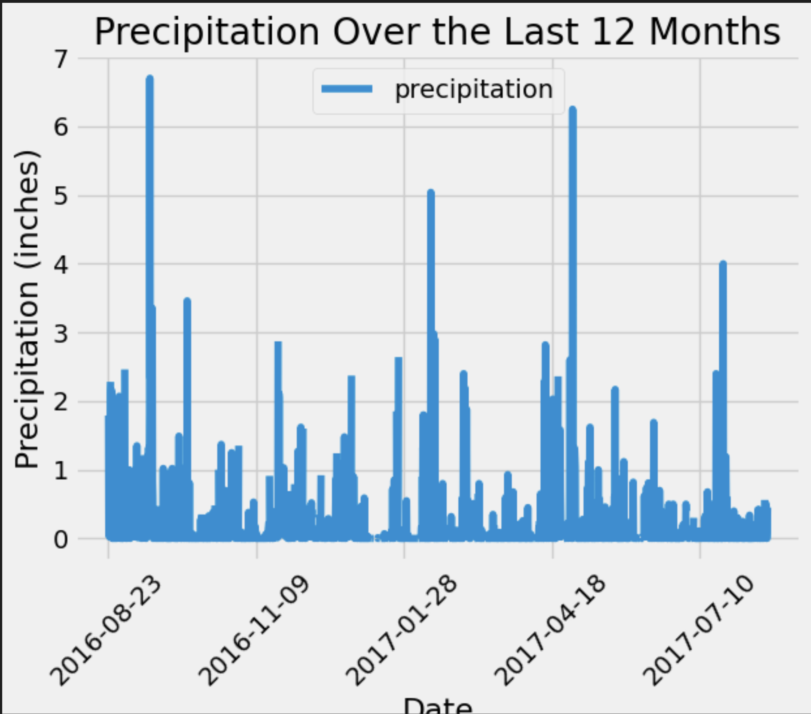
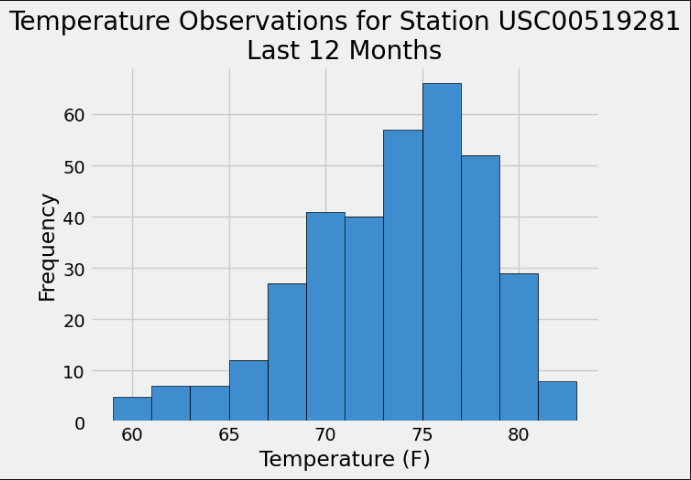
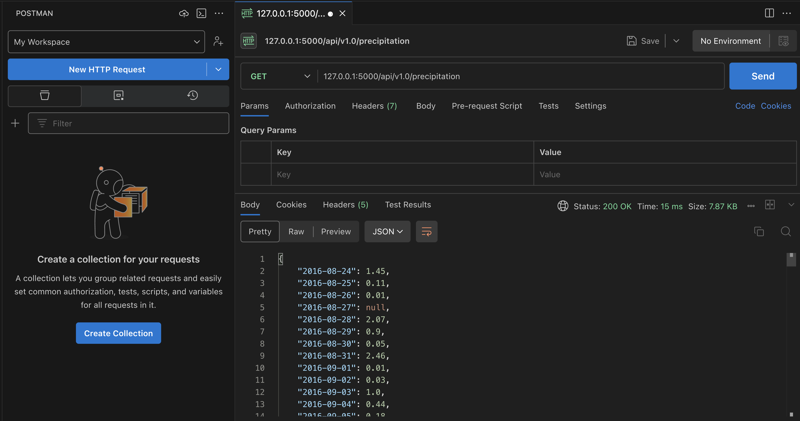

---

# SQLAlchemy Climate Analysis Project

## Overview

Welcome to the SQLAlchemy Climate Analysis Project. This project involves performing a climate analysis of Honolulu, Hawaii, using Python, SQLAlchemy, and Flask. The project is divided into two main parts: climate data analysis and the creation of a Flask API to serve the results of the analysis.

## Project Structure

The project repository contains the following files and directories:

- `app.py`: The main Flask application script.
- `climate_starter.ipynb`: Jupyter notebook containing the climate data analysis.
- `Resources/`: Directory containing the dataset.
  - `hawaii.sqlite`: SQLite database file containing the climate data.

## Data Analysis

### Precipitation Analysis

This analysis involves retrieving and analyzing the last 12 months of precipitation data. The steps include:
- Finding the most recent date in the dataset.
- Querying the previous 12 months of precipitation data.
- Storing the results in a Pandas DataFrame and plotting the data.




### Station Analysis

This analysis focuses on the stations within the dataset. The tasks include:
- Calculating the total number of stations.
- Identifying the most active stations by the number of observations.
- Analyzing temperature data for the most active station over the past year.



## Flask API

The Flask API serves the results of the analysis through various routes:

### Available Routes

- **/** : Landing page listing all available routes.
- **/api/v1.0/precipitation**: Returns the last 12 months of precipitation data.
- **/api/v1.0/stations**: Returns a list of all weather observation stations.
- **/api/v1.0/tobs**: Returns temperature observations for the most active station for the last year.
- **/api/v1.0/<start>**: Returns the minimum, average, and maximum temperature for dates from the start date onwards.
- **/api/v1.0/<start>/<end>**: Returns the minimum, average, and maximum temperature for dates between the start and end date.



## Instructions for Running the Project

1. **Clone the Repository**:
   ```bash
   git clone https://github.com/maslla100/sqlalchemy-challenge
   ```
2. **Navigate to the Project Directory**:
   ```bash
   cd sqlalchemy-challenge
   ```
3. **Set Up the Virtual Environment**:
   ```bash
   python -m venv venv
   source venv/bin/activate   # For MacOS/Linux
   venv\Scripts\activate      # For Windows
   ```
4. **Install the Dependencies**:
   ```bash
   pip install -r requirements.txt
   ```
5. **Run the Flask Application**:
   ```bash
   python app.py
   ```

6. **Access the API**:
   - Open your web browser and navigate to `http://127.0.0.1:5000/` to view the landing page.
   - Test the different API routes listed above.

## License

This project is licensed under the MIT License. See the LICENSE file for more details.

## Contact

If you have any questions or feedback, please feel free to reach out at [Luis.Llamas@maslla.com](mailto:Luis.Llamas@maslla.com).

---

Thank you for exploring this project. Happy coding!

---

